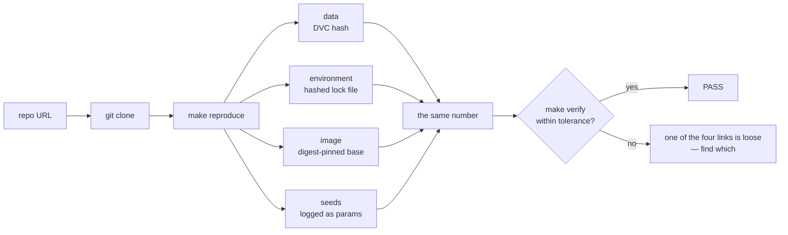
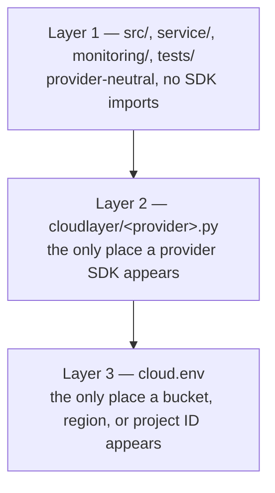

# ITCS355 — Lab 1: Reproducible Training Container

**Released:** end of Session 1 · **Due:** before Session 2 · **Effort:** ~5 hours
**CLO1** · **Marks:** 8 · **Also assessed through:** Drill 1 and Capstone criterion R1 (Reproducible ML Pipeline)
**Cloud used:** object storage and container registry only — this lab is deliberately the least cloud-dependent

**In this repository**

Files: `src/train.py` · `src/data.py` · `src/config.py` · `Dockerfile` · `tests/test_data.py` · `scripts/make_dataset.py` · `scripts/verify_metric.py` · `scripts/portability_audit.py` · `cloudlayer/<provider>.py`

Commands: `make data · make test · make train · make portability-audit · make image · make image-push · make reproduce · make verify`

Every `TODO` marker in those files is a graded decision. Everything around them already works, so you debug your own choices rather than the scaffolding.

---

## Objective

Make your training run reproducible by a stranger who has nothing but your repository URL. Not
"documented" — reproducible. A grader on a different operating system and a different CPU
architecture will clone your repo, run one command, and compare the number that comes out against
the number you claimed.



Any one of those four links breaking produces a different number. The lab is about finding
out which one is loose in your own repo.

## Before you start

- `make cloud-check` passes on all eight slots
- Your provider CLI is authenticated
- `cloud.env` is filled in and is listed in `.gitignore`

---

## Task 1 — Structure the project (30 min)

Move out of the notebook. The target layout:

```
itcs355/
├── cloud.env.example
├── Dockerfile
├── Makefile
├── requirements.txt        # or pyproject.toml with a lock file
├── data/                   # DVC-tracked, not Git-tracked
│   └── .gitignore
├── src/
│   ├── train.py
│   ├── data.py
│   └── config.py           # reads cloud.env, no hardcoded paths
├── cloudlayer/
│   └── <provider>.py       # the only place provider SDKs are imported
├── tests/
│   └── test_data.py
└── README.md
```

Keep your original notebook in `notebooks/` for reference, but nothing in the grading path may
import from it.

**Constraint:** no string in `src/` may contain a bucket name, a provider hostname, or an absolute
path from your machine. Everything comes from `config.py`, which reads `cloud.env`.

## Task 2 — Pin the environment properly (40 min)

`pip freeze` is not reproducibility. It captures what you happen to have installed, on your platform,
today. Do all three of these:

1. **Pin with hashes.** Use `pip-compile --generate-hashes` (or `uv pip compile`, or Poetry's lock
   file). The lock file is committed.
2. **Pin the base image by digest,** not by tag. `python:3.11-slim` moves; `python:3.11-slim@sha256:…`
   does not.
3. **Set the seeds and record them.** Python's `random`, NumPy, and your framework each have their
   own. Log the seed as a parameter, not as a comment.

In your README, state plainly which of these three you would drop first under time pressure, and why.
There is a defensible answer; we will compare answers in Session 2. Pick one and name the failure that
follows from dropping it — an answer that calls all three equally important scores zero on this item.

## Task 3 — Implement your provider adapter (35 min)

Three of the ten methods in `cloudlayer/<provider>.py` are yours this lab: `upload`, `download`, and
`push_image`. The other seven stay `NotImplementedError` until Labs 2 to 5. The file's docstring
carries provider-specific hints.

This is the three-layer discipline the whole course rests on:



Rules that are graded:

- **Parse the URI inside the adapter.** `BLOB_URI` looks like `gs://bucket/prefix` (or `s3://…`,
  or an Azure container URL). Splitting it belongs in Layer 2. `make portability-audit` fails if a
  provider string or SDK import appears anywhere in Layer 1.
- **`push_image` returns the digest reference** — `repo@sha256:…`, not the tag you pushed. A tag can
  be moved to point at different bytes; a digest cannot. During an incident, "which code is serving?"
  must have exactly one answer.
- **Use `cfg.tags(1)` for resource tags as it stands.** Some providers require lowercase, no spaces;
  the helper already satisfies that. Do not "improve" the values, or teardown stops finding your
  resources in Lab 5.

```bash
make portability-audit   # must be clean before you go further
```

## Task 4 — Containerise the training job (60 min)

Write a `Dockerfile` that builds an image capable of running the full training end to end.

Requirements:
- Multi-stage build, so the final image does not carry the compiler toolchain
- Non-root user
- Install dependencies with `--require-hashes` so the lock file from Task 2 is actually enforced
- No credentials baked into any layer — they arrive at runtime from `SECRET_STORE_PATH`
- Builds for `linux/amd64` even if you are on Apple Silicon: `docker buildx build --platform linux/amd64`

The last requirement catches out roughly a third of every cohort. If your image builds on your laptop
and fails on the grader's machine, this is almost always why. On an M-series Mac the build runs under
emulation — several minutes is normal, not a hang.

Then push it:

```bash
make image           # builds for linux/amd64
make image-push      # calls adapter.push_image() → your provider's registry
```

## Task 5 — Version the data (45 min)

Initialise DVC, point its remote at `${BLOB_URI}/dvc`, and track your raw dataset.

```bash
dvc init
dvc remote add -d storage ${BLOB_URI}/dvc
dvc add data/raw
git add data/raw.dvc .dvc/config && git commit -m "track raw data"
dvc push
```

Then build your train/validation/test split **inside the pipeline**, not by hand, and make the split
deterministic given the seed. Write one test in `tests/test_data.py` that fails if any identifier
appears in more than one split. Leakage is the failure this catches, and it is the most common silent
error in student projects.

```bash
make data && make test
```

## Task 6 — Track at least five runs (45 min)

Point MLflow at `MLFLOW_TRACKING_URI` and log, for every run:

- all hyperparameters, including the seed
- the metric you care about, on validation and test separately
- the data version (the DVC hash) and the Git commit SHA
- the trained model as an artifact

Five runs minimum, varying something meaningful — not five identical runs with different seeds. Five
seeds of one configuration is not a study; at least one hyperparameter must be varied with intent.

Keep the spread these runs show. Task 7 needs it.

## Task 7 — Write the README that does the work (30 min)

The README must get a stranger from clone to reproduced metric in **one command**. Assume they have
Docker and nothing else from your setup.

It must state: what the problem is, what the data is and where it comes from, the one command, the
expected metric and tolerance, and roughly how long it takes.

```bash
make reproduce       # the one command
make verify          # compares the produced metric against your claim
```

`make verify` parses one line out of the root `README.md`, and it must be in exactly this shape:

```
expected test_roc_auc: 0.862 ± 0.005
```

Re-measure and update that line after your final change — a claim from three commits ago is the most
common `make verify` failure.

**Choose the tolerance from the spread you actually observed** in Task 6, not from what feels safe.
A fixed seed reproduces to within roughly 0.0005 across machines; varying the seed moves the metric
far more, because the seed moves the split and not only the model. Padding the tolerance to hide
non-determinism you did not investigate is visible to the grader, who compares your stated tolerance
against the variance in your own tracked runs.

---

## Grade yourself before you submit

The grader's script is mechanical, and you can run its substance yourself. Clone your own repository
into a fresh directory — not your working copy, which is full of state you forgot you rely on:

```bash
git clone <your-repo-url> /tmp/fresh && cd /tmp/fresh
cp /path/to/cloud.env .          # the only thing you are allowed to hand over
make reproduce && make verify
```

If that sequence needs one undocumented step, you have found the thing that fails your submission.

## Deliverables checklist

- [ ] Repository with the layout above, pushed and accessible
- [ ] Lock file with hashes; base image pinned by digest; `--require-hashes` used in the build
- [ ] `cloudlayer/<provider>.py` implements `upload`, `download`, and `push_image`
- [ ] `push_image` returns a digest reference, not a tag
- [ ] `make portability-audit` clean — no provider strings in Layer 1
- [ ] `Dockerfile` building for `linux/amd64`, non-root, no baked credentials
- [ ] Image pushed to your provider's registry
- [ ] DVC remote configured and `dvc push` completed
- [ ] Leakage test in `tests/test_data.py`, passing
- [ ] Five or more tracked runs with params, metrics, data version, commit SHA, and artifact
- [ ] `README.md` with the one command, the `expected test_roc_auc: <value> ± <tolerance>` line, and the trade-off answer
- [ ] `make reproduce` and `make verify` both pass from a **fresh clone**
- [ ] `cloud.env` absent from Git history — check, do not assume

## Acceptance criteria

**Passes when** a grader on a different OS and architecture runs your single command and reaches your
reported metric within your stated tolerance, without asking you a question.

**Fails when** any of: the command needs an undocumented environment variable; the image will not run
on `linux/amd64`; the metric differs beyond tolerance with no explanation; a credential appears
anywhere in Git history.

The 8 marks are met-or-not-met. There is no partial credit for a repository that almost reproduces —
harsh-looking, and kinder in practice, because it is the same unambiguous standard for everyone.

## Common failure modes

| Symptom | Cause |
|---|---|
| `exec format error` on the grader's machine | Built for `arm64` on Apple Silicon |
| Metric differs by a small amount every run | A seed you did not set — check your data loader's shuffling |
| `make verify` fails on your own machine | The README claim line was not re-measured after your last change |
| `make portability-audit` fails after the adapter works | You put URI parsing in `src/` instead of `cloudlayer/` |
| Deployment in Lab 3 cannot say which image is running | `push_image` returned the tag instead of the digest |
| `dvc pull` fails for the grader | Remote is private, or credentials were assumed rather than documented |
| Container cannot read data | Absolute local path leaked into `src/` |
| Build succeeds, run fails on import | Dependency installed in the build stage but not copied to the final stage |

## Teardown

Nothing persistent is created in this lab beyond storage and one image, which cost almost nothing.
Still run `make teardown` to confirm the tagging and teardown path works — you will rely on it from
Lab 3 onward, and finding out it is broken then is expensive.

## What Drill 1 covers

Concept questions on technical debt, container layering, digest versus tag pinning, and group
leakage. Plus evidence questions answerable only from your own work: your data version hash, your
five runs' parameter spread, your stated tolerance and how you chose it, and the answer you wrote for
"which pinning would you drop first, and why".
